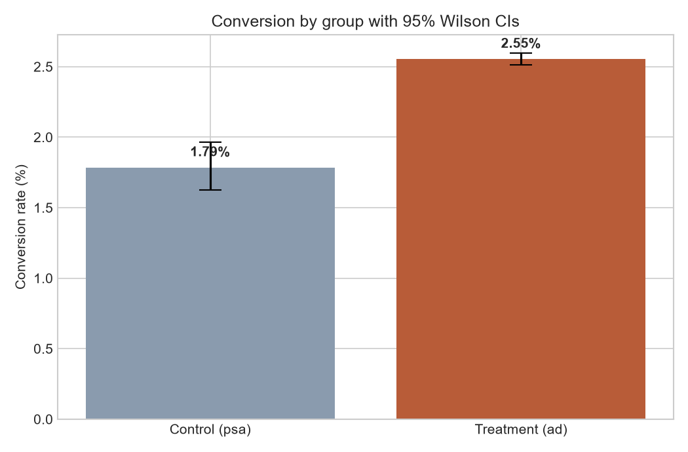

# 📊 A/B Testing — Ad Campaign Effectiveness Analysis

## 🚢 Published

[](https://github.com/Yahya-osama-mohmamed/ab-testing-analysis/actions/workflows/ci.yml)
[](https://github.com/Yahya-osama-mohmamed/ab-testing-analysis/actions/workflows/pages.yml)

The report and notebooks are published at **https://yahya-osama-mohmamed.github.io/ab-testing-analysis/** — rebuilt by GitHub Actions on every push.

There is no container here: nothing in this repo is a service, and wrapping a
web shell around an analysis to have something to deploy would be inventing a
product that does not exist. The analysis is the deliverable.

---

**➡️ Read the main deliverable first: [`report/ab_test_report.md`](report/ab_test_report.md)** —
a standalone business report a non-technical stakeholder can act on.

A statistically rigorous analysis of a marketing A/B test: 588,101 users
randomly shown either real ads (treatment) or public service announcements
(control), outcome = conversion.

## Headline results

| | Control (PSA) | Treatment (Ad) |
|---|---|---|
| Users | 23,524 | 564,577 |
| Conversion | 1.785% | **2.555%** |

**Relative lift +43.1%** · p < 10⁻¹² · 95% CI on absolute lift **[+0.60pp, +0.94pp]** · **Recommendation: roll out**



## What signals rigor here (beyond comparing two rates)

- **Sample Ratio Mismatch (SRM) check** — chi-square on the group split itself
  *before* looking at outcomes (p = 0.9998 vs the intended 96:4 holdout —
  clean). A failed SRM means broken assignment and an untrustworthy
  experiment; most portfolio projects never check.
- **Confidence interval reported, not just a p-value** — the CI is what a
  decision-maker can actually use.
- **Effect size vs significance called out** — with 588k users, "significant"
  is cheap; +43% relative lift is what makes this *practically* meaningful.
- **Retrospective power analysis** — power ≈ 1.0 for the observed effect, so a
  null result would also have been informative (and we show the sample size a
  10% MDE would need).
- **z-test and chi-square agreement demonstrated** (χ² = z² on a 2×2 table),
  with a note on when each generalizes.
- **Heterogeneous treatment effects** — the lift concentrates in high-exposure
  users; segment analysis is flagged as directional (multiple-comparison
  caveat), and exposure is explicitly noted as non-randomized.

## Repo tour

```
notebooks/01_eda_and_sanity_checks.ipynb   group balance, SRM, contamination checks
notebooks/02_hypothesis_testing.ipynb      z-test, chi-square, CI, power — the error-bar chart
notebooks/03_segmentation_analysis.ipynb   effects by exposure tercile and day
src/stats_utils.py                         reusable, documented test functions
tests/test_stats_utils.py                  17 tests, incl. one reproducing the headline
src/run_analysis.py                        end-to-end -> report/results.json
report/ab_test_report.md                   the business deliverable
```

## Reproduce

```bash
uv sync            # creates .venv and installs the locked dependency tree
uv run python -m src.run_analysis          # computes report/results.json
uv run jupyter nbconvert --execute --inplace notebooks/*.ipynb
```

Dependencies are managed with [uv](https://docs.astral.sh/uv/): `pyproject.toml`
declares them, `uv.lock` pins the entire transitive tree, and `uv sync` installs
exactly that. The lockfile is what CI and the container build install from, so
"works on my machine" and "works in the image" are the same resolution.
